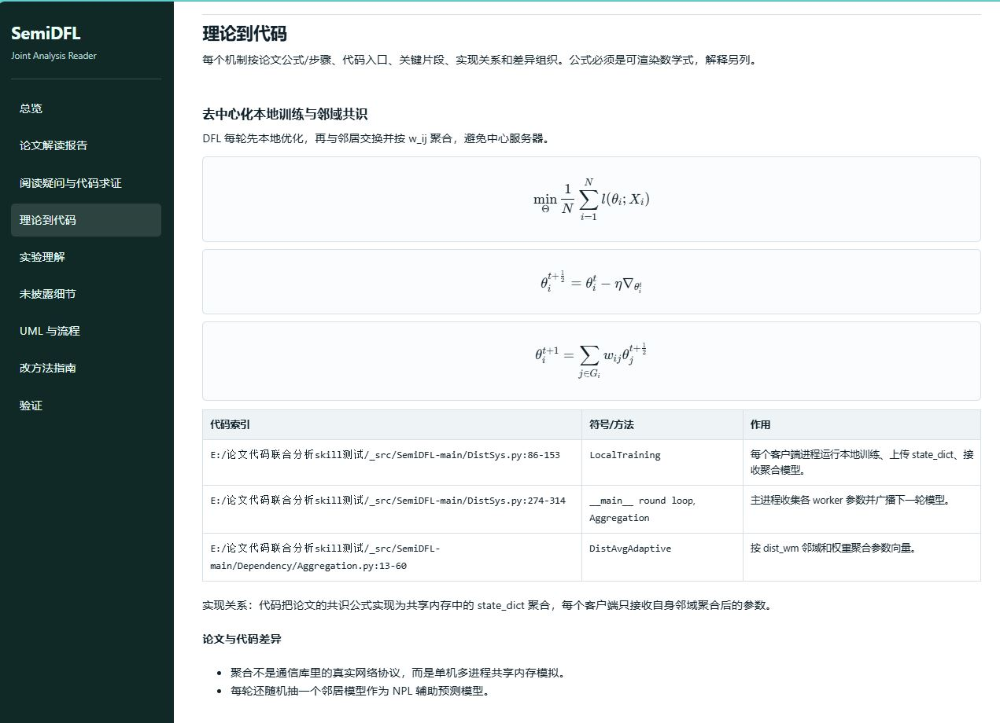
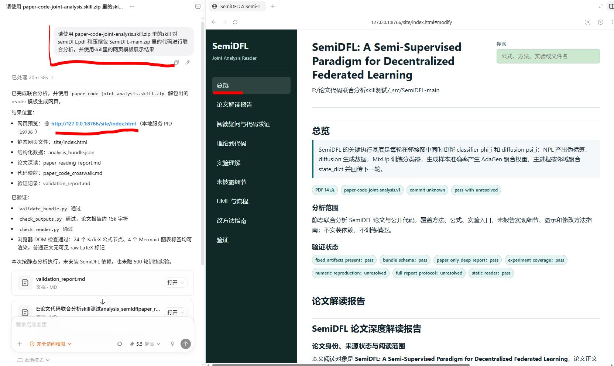
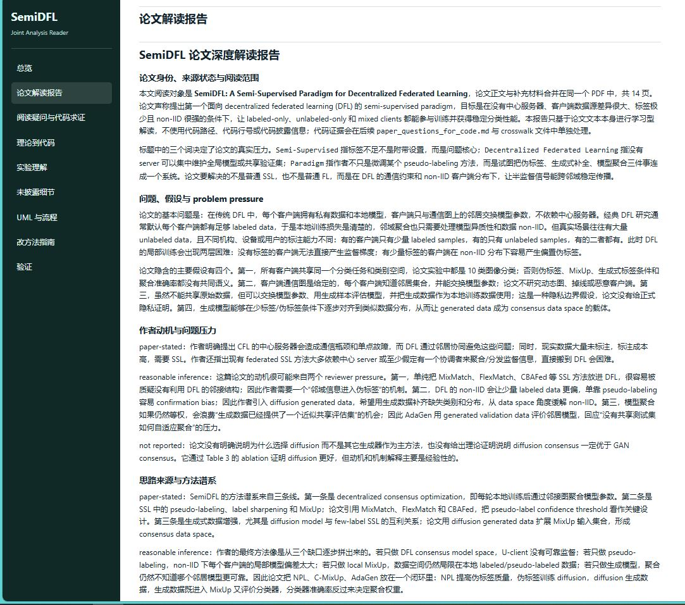
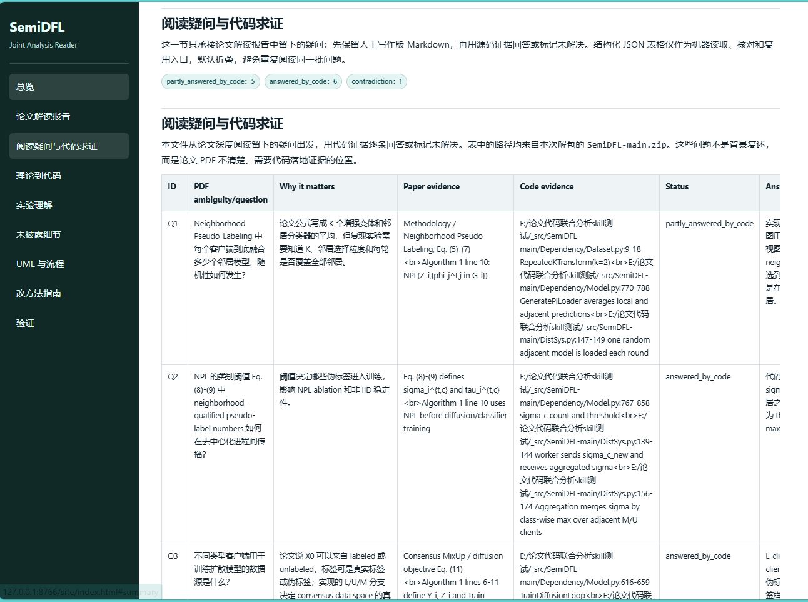
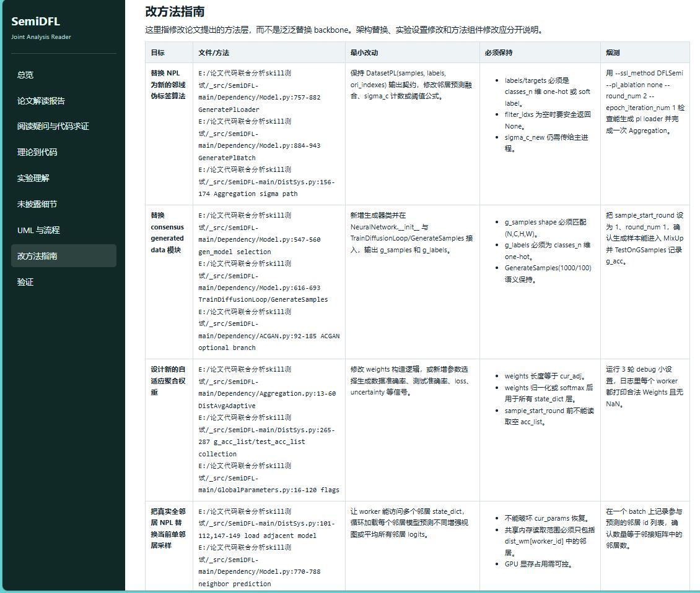
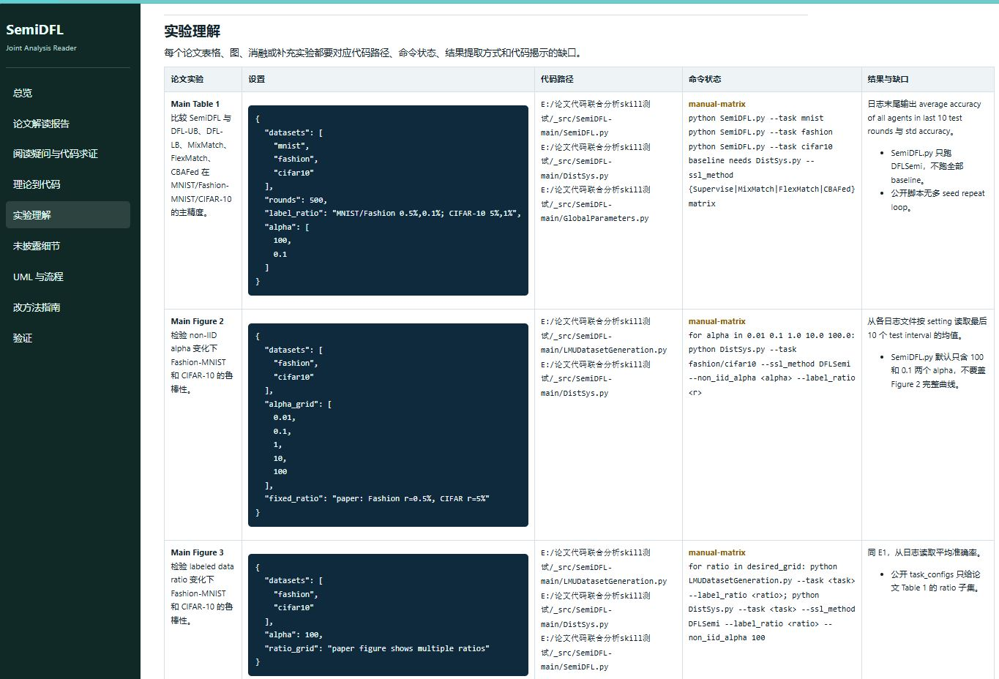
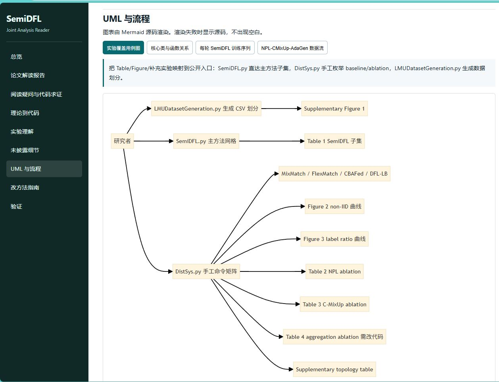
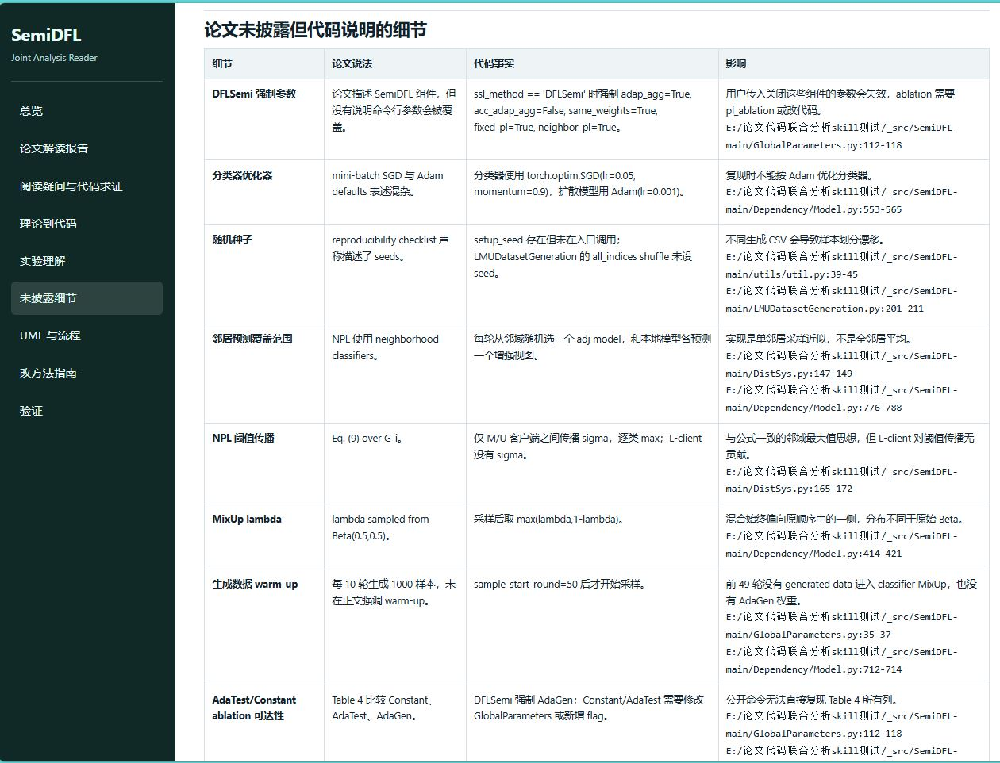
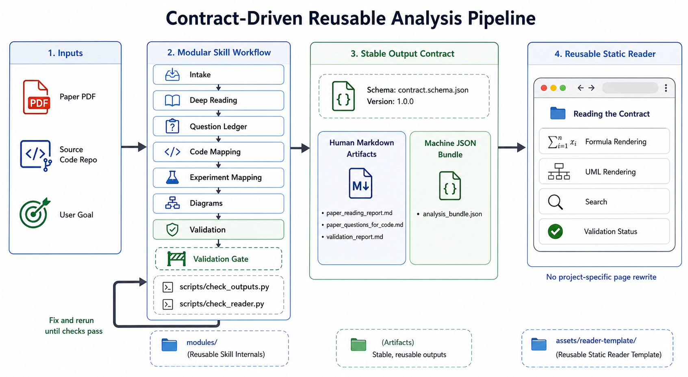
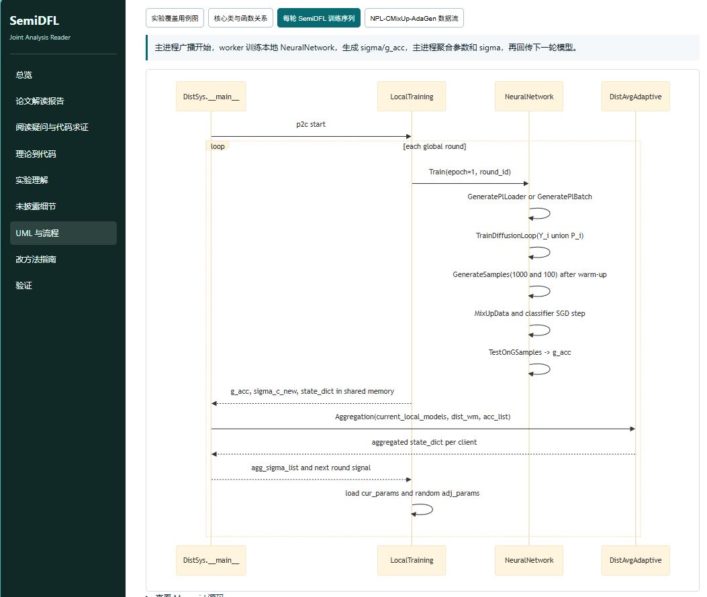

# Paper-Code Joint Analysis Skill

当前版本 / Current package version: `1.0.9`

压缩包 / Package: [`paper-code-joint-analysis.skill.zip`](paper-code-joint-analysis.skill.zip)

## 中文简介

`paper-code-joint-analysis` 是一个只能在 **Codex** 中使用的论文与开源代码联合分析 skill。它的目标不是单独阅读论文，也不是单独浏览仓库，而是把论文中的理论、公式、算法步骤、实验设置与源码中的真实类、方法、参数、命令和日志入口逐项对应起来，帮助用户用代码理解论文。

附件中还提供了 [`contract_driven_reusable_skill_methodology.md`](contract_driven_reusable_skill_methodology.md)，介绍一种契约驱动的可复用 Skill 设计方法学。

分析结果最后使用网页展示，是为了让用户可以直接使用 Codex 的注释功能在页面上圈选不懂的地方，并基于选中的内容继续提问。

感谢 Bristol 的刘欣阳同学提供的素材（SemiDFL）。

### 示例效果：理论到代码映射



适合用于：

- 通过开源实现理解论文方法；
- 对照公式、算法与真实训练流程；
- 找出论文没有披露但代码中体现的参数、默认值、随机性和实验细节；
- 整理论文每个表格、图、消融和补充实验对应的代码入口与复现实验命令；
- 生成 UML、时序图、数据流图和静态网页读者页面；
- 判断如果要修改论文提出的方法，最小需要改哪些文件和方法。

注意：这个包不是 Python 库、命令行工具、浏览器插件或独立网页应用。它必须由 Codex 读取并调用；其中的脚本和模板也默认由 Codex 在项目工作目录中执行。

## 语言、公式和编码要求

报告和网页默认使用中文展示。论文标题、代码标识符、文件路径、命令、类名、方法名和通用缩写可以保留原文，但解释、表格说明、图例、复现缺口、验证说明和网页导航应使用中文。

公式必须在网页中显示为排版后的数学公式，类似 Word 公式效果，而不是把 `\frac`、`\lambda`、`\mathcal` 这类 LaTeX 源码直接显示在正文里。skill 包已经内置 KaTeX 和 Mermaid 到 reader 模板中；生成网页后仍应由 Codex 做浏览器或 DOM 检查，确认公式已渲染且 raw LaTeX 没有作为正常内容暴露。

所有模板、报告和生成网页都应是有效 UTF-8。不要交付含有中文乱码或替换字符的页面、报告或 README。新版检查脚本会把常见 mojibake 标记视为失败。

## 固定输出格式与网页复用

这个 skill 的网页是可复用模板，不应该每换一篇论文就重写页面代码。新论文只需要重新生成固定格式的数据和 Markdown 文件，页面代码会直接加载这些文件。

## 模块化结构

skill 内部按模块组织，方便以后替换升级，而不是在执行时调用其他 skill：

- `modules/deep-reading-gate1.md`：完整学习型精读报告标准。
- `modules/question-led-code-reading.md`：PDF 疑问清单与代码证据状态。
- `modules/modify-method-guide.md`：基于论文框架提出新模型或新算法时的核心修改面。
- `modules/fixed-artifacts-and-reader.md`：固定输出文件、网页模板、公式渲染和验证命令。

如果以后想升级“精读深度”，优先替换 `modules/deep-reading-gate1.md`。如果要升级网页展示或数据格式，再同步修改 `analysis_bundle.json` schema、validator 和 reader 模板。

每次完整分析都应生成同一组文件：

```text
analysis_bundle.json
paper_reading_report.md
paper_questions_for_code.md
paper_code_crosswalk.md
experiment_joint_reading.md
implementation_omissions.md
diagrams.md
modify_method_guide.md
validation_report.md
site/index.html
```

### 示例效果：网页总览

网页总览提供论文解读、理论到代码映射、实验理解、阅读疑问与源码求证、未披露实现细节、图表和改方法指南入口。



### 输出文件说明

`analysis_bundle.json`：机器可读的结构化总索引，供网页读取各模块内容。

`paper_reading_report.md`：完整论文解读报告，解释论文问题、方法、公式、流程、实验和局限。



`paper_questions_for_code.md`：论文阅读中产生的疑问，以及源码能否回答这些疑问的证据。



`paper_code_crosswalk.md`：论文理论、公式、算法步骤与源码文件、类、函数的对应关系。

`experiment_joint_reading.md`：论文实验与代码用例、运行入口、配置和复现状态的对应关系。

`implementation_omissions.md`：论文没有写清楚、但代码中能看到的实现细节。

`diagrams.md`：UML、时序图、数据流图等图示说明。

`modify_method_guide.md`：基于论文框架提出新模型或新算法时，应该优先修改的核心文件和函数。



`validation_report.md`：生成结果和网页展示的检查记录。

`site/index.html`：可在 Codex 中打开的静态网页入口。

### 示例效果：实验、实现细节与时序图

| 实验理解 | 实验 use-case 映射 |
| --- | --- |
|  |  |



### 示例效果：方法学示意图与训练时序图

| 方法学示意图 | 训练时序图 |
| --- | --- |
|  |  |

生成网页时使用：

```text
python scripts/build_static_reader.py <analysis_dir> --force
```

不要为单篇论文手写 `site/index.html`、`site/assets/app.js` 或 `site/assets/styles.css`。如果网页展示能力不够，应修改 skill 包里的 `assets/reader-template/`，然后重新生成网页，这样改进才能被下一篇论文复用。

## 使用方式：只能在 Codex 中自然语言调用

推荐做法：

1. 新建一个空的 Codex 项目工作目录。
2. 将 `paper-code-joint-analysis.skill.zip`、目标论文和目标源码放在这个空项目下。
3. `example/` 中已经提供 SemiDFL 示例论文 [`semidfl-paper.pdf`](example/semidfl-paper.pdf)、示例源码 [`semidfl-code.zip`](example/semidfl-code.zip)、示例截图和示例提示词 [`prompt.txt`](example/prompt.txt)。
4. 复现示例时，把示例论文、示例源码和 skill 压缩包一起放到空项目下，然后按 [`example/overview.jpg`](example/overview.jpg) 左侧上方展示的提示词提问即可；同一提示词也已经作为 `example/prompt.txt` 提供。
5. 如果分析自己的论文和代码，在 Codex 对话中明确要求使用这个 skill，并提供论文 PDF、arXiv 链接或标题，以及源码仓库链接或本地源码路径。
6. 如果只想静态分析，要明确说“不运行训练”；如果要复现实验，要说明允许安装依赖和运行脚本。

示例提示词：

简单版本：

```text
请使用 paper-code-joint-analysis.skill.zip 里的 skill，对 semidfl-paper.pdf 和 semidfl-code.zip 里的代码进行联合分析，并使用 skill 里的网页模板展示结果。
```

完整版本：

```text
请使用 paper-code-joint-analysis.skill.zip 里的 paper-code-joint-analysis skill，
联合分析这篇论文和它的官方代码。不运行训练，只做静态分析。
请输出完整论文解读报告、理论到代码映射、每个实验对应的代码用例、
由论文解读报告产生的阅读疑问及源码回答、
论文未披露但代码显示的实现细节、UML/时序图、基于论文框架提出新模型或新算法时应修改的核心函数指南，
并生成一个可在 Codex 中打开的静态网页。

论文：<PDF 路径或 arXiv 链接>
源码：<GitHub 链接或本地路径>
```

如果研究领域有关键执行机制，也应直接说明。例如联邦学习或去中心化联邦学习论文，应要求特别分析通信、拓扑、参数交换和聚合。

## 输出检查

完成分析后应检查：

- 是否生成 `analysis_bundle.json` 并通过 schema 校验；
- 论文解读报告是否完整，且不混入代码映射；
- 是否生成 `paper_questions_for_code.md`，并且每个主要疑问都有源码证据状态；
- 公式是否以排版数学公式显示，而不是文字解释或 raw TeX；
- 每个论文实验是否都有代码路径、命令状态和实现缺口；
- “改方法指南”是否聚焦新模型/新算法的核心修改面，而不是调参；
- UML 图中的类名、对象名和消息名是否来自真实源码；
- 静态网页是否能在 Codex 中打开，并展示完整报告、图表和验证结果；
- 模板、报告、README 和网页是否没有乱码。

## English Overview

`paper-code-joint-analysis` is a Codex-only skill for jointly analyzing a research paper and its open-source implementation. It helps a reader understand the paper through code: formulas, algorithms, method components, experiments, hidden implementation details, and modification points must be mapped to real source files, classes, methods, parameters, and commands.

The repository also includes [`contract_driven_reusable_skill_methodology.md`](contract_driven_reusable_skill_methodology.md), which describes a contract-driven methodology for designing reusable Skills.

This package is not a Python library, CLI tool, browser extension, or standalone web app. It must be used inside Codex.

Reports and generated static readers are Chinese by default. Formulas should render as typeset math, not visible LaTeX source. The reusable reader template loads fixed artifacts such as `analysis_bundle.json`, `paper_reading_report.md`, `paper_questions_for_code.md`, `paper_code_crosswalk.md`, and `experiment_joint_reading.md`.

### English Output File Descriptions

`analysis_bundle.json`: a machine-readable structured index used by the web reader.

`paper_reading_report.md`: a full paper reading report covering the problem, method, formulas, workflow, experiments, and limitations.

`paper_questions_for_code.md`: reading questions raised by the paper, plus code evidence showing whether each question can be answered.

`paper_code_crosswalk.md`: mappings from paper theory, formulas, and algorithm steps to source files, classes, and functions.

`experiment_joint_reading.md`: mappings from paper experiments to code use cases, entry points, configurations, and reproduction status.

`implementation_omissions.md`: implementation details that are unclear or omitted in the paper but visible in the code.

`diagrams.md`: UML, sequence diagrams, data-flow diagrams, and related visual explanations.

`modify_method_guide.md`: core files and functions to modify when proposing a new model or algorithm inside the paper framework.

`validation_report.md`: checks for generated artifacts and web reader rendering.

`site/index.html`: the static web reader entry that can be opened in Codex.

## English Usage

Recommended workflow:

1. Create an empty Codex project workspace.
2. Put `paper-code-joint-analysis.skill.zip`, the target paper, and the target source code in that empty workspace.
3. The `example/` folder includes the SemiDFL sample paper [`semidfl-paper.pdf`](example/semidfl-paper.pdf), sample source archive [`semidfl-code.zip`](example/semidfl-code.zip), result screenshots, and the sample prompt [`prompt.txt`](example/prompt.txt).
4. To reproduce the example, place the sample paper, sample source archive, and skill zip in the empty project, then ask Codex with the prompt shown in the upper-left area of [`example/overview.jpg`](example/overview.jpg). The same prompt is also provided as `example/prompt.txt`.
5. For your own paper and code, ask Codex to use this skill and provide the paper PDF, arXiv link or title, plus the GitHub URL or local path for the source repository.
6. If you only want static analysis, explicitly say "do not run training"; if you want experiment reproduction, state that dependency installation and script execution are allowed.

### English Example Screenshots

| Overview | Paper reading report |
| --- | --- |
|  |  |

| Reading questions and code evidence | Experiment understanding |
| --- | --- |
|  |  |

| Experiment use-case mapping | Implementation omissions |
| --- | --- |
|  |  |

### English Example: Methodology Diagram And Training Sequence Diagram

| Methodology diagram | Training sequence diagram |
| --- | --- |
|  |  |


## License

MIT-0.
